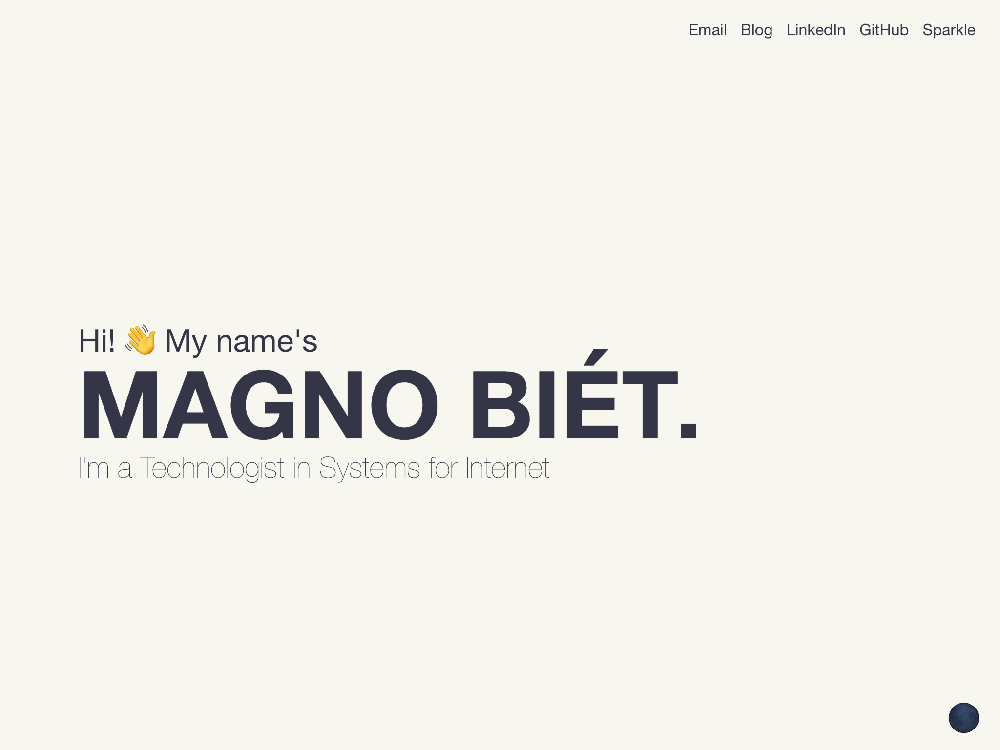

# magnobiet.com

> Made with ♥ using [vanilla](https://github.com/magnobiet/vanilla).



Proudly hosted by [GitHub](https://github.com/).

[](https://www.cloudflare.com/)

## TL;DR


### Development

```bash
git clone git@github.com:magnobiet/magnobiet.github.io.git magnobiet.com && cd $_
git checkout develop

npm install
npm run dev
```

### Build

```bash
npm run build
npm run deploy
```

## Licence

This project is licensed under the [MIT License](https://magno.mit-license.org/2016). Copyright © Magno Biét
